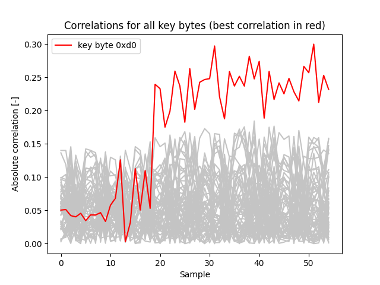

# AES Power Analysis Attack
This is implementation of an attack on AES based on power analysis. This project was created as part of the Modern Cryptology course at Technical University of Denmark.

## Description
The script implements attack on AES using differential power analysis. Key byte can be discovered correlating power consumption traces (input files Tx.dat) with Hamming
weights of simulated traces, both for vector of plaintexts (inputx.dat).

## Result Example

## Project Team
* [Lukas Kyzlik](https://github.com/garnagar)
* [William Wulff](https://github.com/WilliamWulff)
